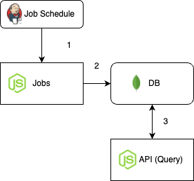

# Proposal solution

Needed repos for test solution:

- https://github.com/emanuel-maker/infra.git
- https://github.com/emanuel-maker/jobs
- https://github.com/emanuel-maker/scryfall-server

1. Download respos
2. Execute ./run-docker.sh in every repo (take into account running it respecting the order, its means running infra first and the others).

## Endpoints

- GET http://localhost:8085/collection/:value
- GET http://localhost:8085/id/:value
- GET http://localhost:8085/cards/name/:value
- GET http://localhost:8085/cards/game-mode/:value

## Notes

- I assumed that the client wants to extract information from time to time or periodically, for that reason I created a service called 'jobs'. (Jenkins service is not implemented)

- It will be great maybe do some naming refactors, fix code smells, configure envs, handler errors, test, etc. (pending stuffs).

- Maybe its more accurate to have in scryfall-server function separately for every use case, maybe it will be great group those function in class object. (mix between paradigms)

